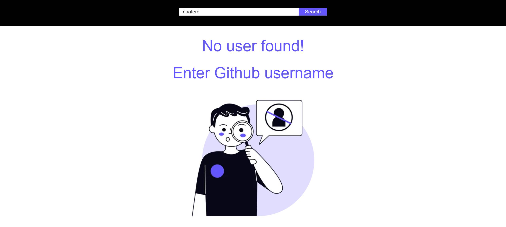

## Deployed Application
[Link to Deployed Application](https://fyle-angular-frontend-assignment.netlify.app/)

## Description
This project is a web application built with Angular that enables users to search for GitHub users by their username. Upon entering a username and clicking the search button, the application fetches information about the user including their basic details and repositories. The application provides pagination for the user's repositories, allowing the user to navigate through multiple pages of repositories.

## Functionalities Covered
- **Search User**: The `search-user` component handles the search functionality. Users can input a GitHub username, and upon clicking the search button, the application fetches and displays the user's information.
- **User Info and User Repos**: The `user-info` and `user-repo` components display the basic details of the user and their repositories respectively. This includes the user's avatar, name, bio, and a list of repositories with their details.
- **Pagination**: The `pagination` component manages server-side pagination. It allows users to navigate through multiple pages of repositories retrieved from the GitHub API. Additionally, it provides a dropdown to select the number of repositories per page, with a default of 10 repositories per page and a maximum of 100 repositories per page.
- **Page Size**: The `page-size` component maintains the page size of repositories. Users can choose the number of repositories they want to see per page from a dropdown menu.
- **Empty Zero State**: The `empty-zero-state` component displays an empty state when no user is found with the entered GitHub username. This provides a clear indication to the user that their search returned no results.
- **Loader**: The application displays a skeleton loader while fetching data from the GitHub API to indicate that the request is in progress.

## Functionalities Provided by the Company and Coverage
- **Search by GitHub Username**: Implemented ✔️
- **Zero State Display**: Implemented ✔️
- **Server-side Pagination**: Implemented ✔️
- **Page Size Configuration**: Implemented ✔️
- **Loader for API Calls**: Implemented ✔️
- **No duplicacy of API Calls**: Implemented ✔️
- **Test cases**: Implemented ✔️

## Technologies Used
- **Frontend Framework**: Angular
- **Styling**: Tailwind CSS

## Screenshots
### 10 Repositories By Default

### Data saved to mem and Not calling API agian and again

### zero-state

## Usage
1. Enter a GitHub username in the search bar.
2. Click the search button.
3. View the user's information and repositories.
4. Navigate through the pages of repositories using pagination.
